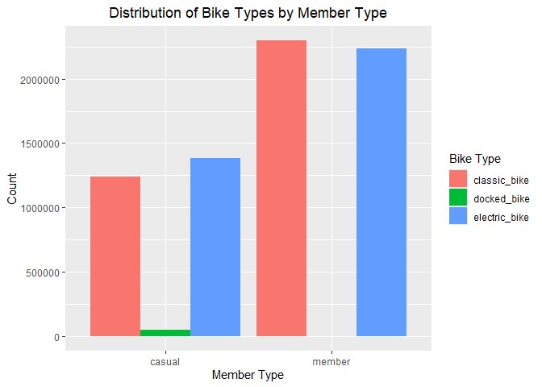

Analysis of Cyclistic’s Casual Riders vs Annual Members
================
Muhaimin Ahmed
August 28, 2024

# Introduction

This is a CAPSTONE case study I did as part of my Google Data Analytics
Certification. In this case study, I work for a fictional company,
Cyclistic and have to answer business questions from my manager Lily
Moreno.

## About Cyclistic

Cyclistic is a bike-share program that features more than 5,800 bicycles
and 600 docking stations. The director of marketing believes the
company’s future success depends on maximizing the number of annual
memberships. Therefore, I want to understand how casual riders and
annual members use Cyclistic bikes differently. From these insights, I
will design a new marketing strategy to convert casual riders into
annual members.

## Guiding Questions

The questions guiding this analysis are the following:

1.  How do annual members and casual riders use Cyclistic bikes
    differently?
2.  Why would casual riders buy Cyclistic annual memberships?
3.  How can Cyclistic use digital media to influence casual riders to
    become members?

## Location of the Data

The data used for this analysis is located
[here](https://divvy-tripdata.s3.amazonaws.com/index.html). From the
available data the 12 most recent months have been chosen for analysis
(August 2023 to August 2024).

## Business Task

Identify potential opportunities for growth and recommendations for the
Cyclistic marketing strategy to convert more casual riders to become
members.

# Preparing the Data

## Libraries

These are the libraries that are used to complete this case study.

``` r
library(tidyverse)
```

    ## ── Attaching core tidyverse packages ──────────────────────── tidyverse 2.0.0 ──
    ## ✔ dplyr     1.1.4     ✔ readr     2.1.5
    ## ✔ forcats   1.0.0     ✔ stringr   1.5.1
    ## ✔ ggplot2   3.5.1     ✔ tibble    3.2.1
    ## ✔ lubridate 1.9.3     ✔ tidyr     1.3.1
    ## ✔ purrr     1.0.2     
    ## ── Conflicts ────────────────────────────────────────── tidyverse_conflicts() ──
    ## ✖ dplyr::filter() masks stats::filter()
    ## ✖ dplyr::lag()    masks stats::lag()
    ## ℹ Use the conflicted package (<http://conflicted.r-lib.org/>) to force all conflicts to become errors

``` r
library(dplyr)
library(readr)
library(lubridate)
library(ggplot2)
```

## Merging the Data

12 months of data are merged onto one data frame named cyclistic_df.

``` r
# temp <- list.files("./Cyclistic_Data", full.names = TRUE, pattern = "\\.csv$")
# 
# cyclistic_df <- readr::read_csv(temp, id = "Bike_Rides_2306_to_2407")
# 
# write.csv(cyclistic_df, "./Cyclistic_Data/cyclistic_merged_data.csv")

cyclistic_df <- readr::read_csv("./Cyclistic_Data/cyclistic_merged_data.csv")
```

    ## New names:
    ## Rows: 7202961 Columns: 15
    ## ── Column specification
    ## ──────────────────────────────────────────────────────── Delimiter: "," chr
    ## (8): Bike_Rides_2306_to_2407, ride_id, rideable_type, start_station_nam... dbl
    ## (5): ...1, start_lat, start_lng, end_lat, end_lng dttm (2): started_at,
    ## ended_at
    ## ℹ Use `spec()` to retrieve the full column specification for this data. ℹ
    ## Specify the column types or set `show_col_types = FALSE` to quiet this message.
    ## • `` -> `...1`

Let’s focus on the following columns to start the analysis:

- ride_id: Ride unique ID.
- member_casual: Cyclistic member or casual rider.
- started_at and ended_at: Ride start and end times.
- rideable_type: Electric, classic or docked bike.

``` r
cyclistic_df_v2 <- select(cyclistic_df, ride_id, member_casual, started_at, ended_at, rideable_type)
head(cyclistic_df_v2)
```

    ## # A tibble: 6 × 5
    ##   ride_id    member_casual started_at          ended_at            rideable_type
    ##   <chr>      <chr>         <dttm>              <dttm>              <chr>        
    ## 1 6F1682AC4… member        2023-06-05 13:34:12 2023-06-05 14:31:56 electric_bike
    ## 2 622A1686D… member        2023-06-05 01:30:22 2023-06-05 01:33:06 electric_bike
    ## 3 3C88859D9… member        2023-06-20 18:15:49 2023-06-20 18:32:05 electric_bike
    ## 4 EAD8A5E02… member        2023-06-19 14:56:00 2023-06-19 15:00:35 electric_bike
    ## 5 5A36F2193… member        2023-06-19 15:03:34 2023-06-19 15:07:16 electric_bike
    ## 6 CF682EA7D… member        2023-06-09 21:30:25 2023-06-09 21:49:52 electric_bike

## Checking for Missing Values

``` r
sum(is.na(cyclistic_df_v2))
```

    ## [1] 0

The data is complete for the columns of interest.

# Summarizing the Data

Using the selected fields the ride length can be calculated and the day
of the week can also be determined and store in cyclistic_df_v2. I am
also adding a month year column and sorting it chronologically for later
use.

``` r
cyclistic_df_v3 <- mutate(cyclistic_df_v2, 
                          ride_lengths = abs(seconds_to_period(ended_at-started_at)), 
                          day_of_week = weekdays(started_at), 
                          month_year = format(started_at, "%b-%y")
                          ) %>%
  arrange(started_at) %>%  # Arrange the data by the original date-time column
  mutate(
    month_year = factor(month_year, levels = unique(month_year), ordered = TRUE)
  )
head(cyclistic_df_v3)
```

    ## # A tibble: 6 × 8
    ##   ride_id    member_casual started_at          ended_at            rideable_type
    ##   <chr>      <chr>         <dttm>              <dttm>              <chr>        
    ## 1 1797E2799… member        2023-06-01 00:00:44 2023-06-01 00:14:16 classic_bike 
    ## 2 ECB6F680E… member        2023-06-01 00:00:47 2023-06-01 00:04:15 classic_bike 
    ## 3 76862A2B6… casual        2023-06-01 00:00:55 2023-06-01 00:08:23 electric_bike
    ## 4 88AF94DE4… member        2023-06-01 00:00:58 2023-06-01 00:11:17 electric_bike
    ## 5 40662A8D6… casual        2023-06-01 00:00:59 2023-06-01 00:08:21 electric_bike
    ## 6 02FD037E5… member        2023-06-01 00:01:03 2023-06-01 00:02:56 electric_bike
    ## # ℹ 3 more variables: ride_lengths <Period>, day_of_week <chr>,
    ## #   month_year <ord>

# Analyzing the data

``` r
max(cyclistic_df_v3$ride_lengths)
```

    ## [1] 59.999

``` r
mean(cyclistic_df_v3$ride_lengths)
```

    ## [1] 29.41899

``` r
mode_char <- function(x) unique(x)[which.max(tabulate(match(x, unique(x))))]
mode_char(cyclistic_df_v3$day_of_week)
```

    ## [1] "Saturday"

``` r
mode_char(cyclistic_df_v3$rideable_type)
```

    ## [1] "electric_bike"

``` r
cyclistic_df_v3 %>%
  group_by(member_casual) %>%
  summarize(avg_ride_length = mean(ride_lengths, na.rm = TRUE))
```

    ## # A tibble: 2 × 2
    ##   member_casual avg_ride_length
    ##   <chr>                   <dbl>
    ## 1 casual                   29.4
    ## 2 member                   29.4

We can conclude the following so far:

- The longer ride was about an hour.
- Average ride taking approximately 30 minutes.
- Saturday is the most popular day for all users to ride bikes.
- Electric bikes are more used than classic bikes.
- On average there is no significant difference between casual and
  member users for ride length.

## Further Summarizing the Data

``` r
bike_type_by_member <- cyclistic_df_v3 %>%
  group_by(member_casual, rideable_type) %>%
  summarise(count = n()) %>%
  pivot_wider(names_from = rideable_type, values_from = count, values_fill = 0) %>%
  gather(key = "bike_type", value = "count", -member_casual)
```

    ## `summarise()` has grouped output by 'member_casual'. You can override using the
    ## `.groups` argument.

``` r
head(bike_type_by_member)
```

    ## # A tibble: 6 × 3
    ## # Groups:   member_casual [2]
    ##   member_casual bike_type       count
    ##   <chr>         <chr>           <int>
    ## 1 casual        classic_bike  1241026
    ## 2 member        classic_bike  2296910
    ## 3 casual        docked_bike     49355
    ## 4 member        docked_bike         0
    ## 5 casual        electric_bike 1380781
    ## 6 member        electric_bike 2234889

# Visualization

``` r
ggplot(bike_type_by_member, aes(x = member_casual, y = count, fill = bike_type)) +
  geom_bar(stat = "identity", position = "dodge") +
  labs(title = "Distribution of Bike Types by Member Type",
       x = "Member Type",
       y = "Count",
       fill = "Bike Type") + 
  theme(plot.title = element_text(hjust = 0.5))
```

<!-- -->

We can see that there are already much more member users than there are
casual users. However, both casual and member users use the classic and
electric bikes relatively equally. This may mean that it is based on
availability over preference. However more data is required to derive
further conclusions from this graph.

``` r
summarized_cyclistic_data <- cyclistic_df_v3 %>%
  group_by(day_of_week, member_casual) %>%
  summarize(avg_ride_length = mean(ride_lengths), 
            num_rides = n())
```

    ## `summarise()` has grouped output by 'day_of_week'. You can override using the
    ## `.groups` argument.

``` r
summarized_cyclistic_data$day_of_week <- factor(summarized_cyclistic_data$day_of_week, c("Monday", "Tuesday", "Wednesday", "Thursday","Friday","Saturday", "Sunday"))
```

``` r
head(summarized_cyclistic_data)
```

    ## # A tibble: 6 × 4
    ## # Groups:   day_of_week [3]
    ##   day_of_week member_casual avg_ride_length num_rides
    ##   <fct>       <chr>                   <dbl>     <int>
    ## 1 Friday      casual                   29.4    401059
    ## 2 Friday      member                   29.4    651872
    ## 3 Monday      casual                   29.4    307008
    ## 4 Monday      member                   29.4    630628
    ## 5 Saturday    casual                   29.4    555063
    ## 6 Saturday    member                   29.4    598468

``` r
ggplot(data = summarized_cyclistic_data, aes(x = day_of_week, y = avg_ride_length, fill = member_casual)) +
  geom_bar(position = "dodge", stat = "identity") +
  labs(title = "Average Ride Length for Users by Day of the Week",
       x = "Day of the week",
       y = "Average Ride Length",
       fill = "User Type") + 
  theme(plot.title = element_text(hjust = 0.5))
```

<!-- -->

As discussed before there is no significant difference in ride length
between casual and member users. This graph clarifies this further by
showing the it fluctuates very little throught the week.

``` r
ggplot(data = summarized_cyclistic_data, aes(x = day_of_week, y = num_rides, fill = member_casual)) +
  geom_bar(position = "dodge", stat = "identity") +
  labs(title = "Number of Rides for Users by Day of the Week",
       x = "Day of the week",
       y = "Number of Rides",
       fill = "User Type") + 
  theme(plot.title = element_text(hjust = 0.5))
```

<!-- -->

This graph shows that more member users ride during the week than in the
weekend and there are more casual rider trips during the weekend. This
means that member users use the service to commute to work while casual
users use it leisurely on the weekend. Also as it was seen in the first
graph, even though there are more casual riders in the weekend it is
still less than the number of member users.

``` r
monthly_cyclistic_data <- cyclistic_df_v3 %>%
  group_by(month_year, member_casual) %>%
  summarize(avg_ride_length = mean(ride_lengths), 
            num_rides = n())
```

    ## `summarise()` has grouped output by 'month_year'. You can override using the
    ## `.groups` argument.

``` r
head(monthly_cyclistic_data)
```

    ## # A tibble: 6 × 4
    ## # Groups:   month_year [3]
    ##   month_year member_casual avg_ride_length num_rides
    ##   <ord>      <chr>                   <dbl>     <int>
    ## 1 Jun-23     casual                   29.3    301230
    ## 2 Jun-23     member                   29.3    418388
    ## 3 Jul-23     casual                   29.4    331358
    ## 4 Jul-23     member                   29.3    436292
    ## 5 Aug-23     casual                   29.4    311130
    ## 6 Aug-23     member                   29.4    460563

I was also curious to see the number of rides throughout a year. And
unsurprisingly there are more rides in the warmer months than there are
in the colder months. Casual riders drop off much more than the member
users. Once again it comes back to the difference in the reason why the
two types of users use the service. Casual users use it for leisure so
they can afford not biking as much in the colder months, however more
member users may use this service for commute to work which can be why
their numbers don’t drop as low.

``` r
ggplot(data = monthly_cyclistic_data, aes(x = month_year, y = num_rides, fill = member_casual)) +
  geom_bar(position = "dodge", stat = "identity") +
  labs(title = "Number of Rides for Users by Month",
       x = "Month and Year",
       y = "Number of Rides",
       fill = "User Type") + 
  theme(plot.title = element_text(hjust = 0.5), 
        axis.text.x = element_text(angle = 45, size = 8))
```

<!-- -->

# Conclusion

We can now use our analysis to answer the aforementioned guiding
questions.

## Difference between annual and casual riders.

According to the data, more annual members ride during the week than the
weekend. This may mean that annual members use Cyclistic to commute to
work during the week which is why they are less likely to use it during
the weekend. On the other hand, more casual riders use Cyclistic during
the weekend. This hints at casual riders using Cyclistic for leisurely
purposes during their time off in the weekend.

## Reasons to switch to an annual membership for the casual rider.

Casual riders may consider purchasing Cyclistic annual memberships for
several reasons:

1.  Cost Savings: If a casual rider finds themselves using Cyclistic
    more frequently over time, they might realize that the cost of
    individual rides adds up. An annual membership could be more
    cost-effective if they plan to use the service regularly, even if
    primarily on weekends.

2.  Flexibility and Convenience: An annual membership offers the
    flexibility to ride anytime without worrying about the cost of each
    trip. For riders who value convenience and spontaneity, an annual
    membership removes the hassle of repeatedly purchasing single rides.

3.  Increased Usage Over Time: Casual riders who initially use Cyclistic
    for leisurely weekend rides might develop a habit or enjoy the
    experience enough to start using it more frequently, perhaps even
    incorporating it into their weekly routine. An annual membership
    could be a logical step as their usage increases.

4.  Commitment to a Healthier Lifestyle: Some casual riders might see an
    annual membership as a commitment to a healthier, more active
    lifestyle. Regular biking, even if only on weekends, can be part of
    a fitness routine or a way to explore the city.

5.  Special Promotions or Incentives: Cyclistic might offer promotions,
    discounts, or added benefits that make an annual membership more
    appealing to casual riders. For example, discounts on annual
    memberships during certain times of the year could encourage casual
    riders to commit.

6.  Supporting a Green Initiative: Riders who are environmentally
    conscious might choose to buy an annual membership as a way of
    supporting sustainable transportation options, even if their usage
    is primarily for leisure.

7.  Peer Influence: If a rider’s friends or family members have annual
    memberships, they might be encouraged to get one themselves to join
    group rides or participate in shared activities.

These factors can make the annual membership appealing to casual riders,
even if their primary usage remains centered around the weekend.

## Recomendation to incentivize casual to member rider conversion.

Cyclistic can leverage digital media to influence casual riders to
become members through several strategic approaches:

1.  Targeted Advertising:

- Social Media Ads: Use platforms like Instagram, Facebook, and Twitter
  to run targeted ads that highlight the benefits of an annual
  membership. These ads can be customized based on user behavior, such
  as those who have previously rented bikes or visited the Cyclistic
  website.
- Google Ads: Implement search and display ads targeting keywords like
  “bike rental,” “weekend activities,” or “leisure biking.” These ads
  can direct users to landing pages that explain the advantages of a
  membership.

2.  Email Marketing:

- Personalized Offers: Send personalized emails to casual riders with
  exclusive discounts or promotions for upgrading to an annual
  membership. Emails can include usage statistics showing how much they
  could save with a membership.
- Usage-Based Recommendations: Based on data, email casual riders after
  a certain number of trips, highlighting how close they are to the cost
  of an annual membership and offering a discount to close the gap.

3.  Engaging Content:

- Blogs and Articles: Create blog posts or articles on the Cyclistic
  website discussing topics like “Top 10 Weekend Biking Trails,” subtly
  promoting how an annual membership can enhance these experiences.
- Social Media Content: Share success stories or testimonials from
  casual riders who upgraded to an annual membership, emphasizing the
  benefits they’ve experienced, like cost savings or improved health.
- Video Content: Produce short, engaging videos for platforms like
  YouTube or TikTok, showcasing real-life scenarios where casual riders
  benefit from an annual membership, such as commuting to work, weekend
  outings, or spontaneous rides.

4.  Referral Programs:

- Incentivized Referrals: Launch a referral program where current
  members can invite casual riders to join with a discount on their
  first annual membership. Reward both the referrer and the new member
  with additional ride credits or discounts.

5.  Social Proof and Influencer Partnerships:

- Testimonials and Reviews: Encourage satisfied members to share their
  experiences on review sites, social media, or through testimonials
  featured on the Cyclistic website.
- Influencer Collaborations: Partner with local influencers who align
  with the brand’s values (e.g., fitness enthusiasts, eco-friendly
  advocates) to promote the annual membership through their platforms,
  providing them with free memberships or other incentives.

6.  Interactive Campaigns and Challenges:

- Biking Challenges: Create digital challenges that encourage casual
  riders to track their rides through an app, offering rewards for
  milestones that could be best utilized with an annual membership.
- Gamification: Incorporate gamification elements in an app where users
  earn points or badges for rides taken, with rewards or discounts on
  annual memberships once certain thresholds are met.

7.  Retargeting Strategies:

- Website Retargeting: Use cookies to track casual riders who have
  visited the Cyclistic website or app but haven’t purchased a
  membership. Serve them retargeted ads on other websites and social
  media platforms, emphasizing the benefits of an annual membership.
- Abandoned Cart Emails: If Cyclistic offers online membership
  purchases, send automated emails to users who begin the membership
  purchase process but do not complete it, reminding them of the
  benefits and offering a limited-time discount.

8.  Exclusive Member Content:

- Webinars and Virtual Events: Host webinars or virtual events
  discussing the best biking routes, maintenance tips, or health
  benefits of biking, offering special content or early access to
  members. Promote these events to casual riders to entice them to join
  for exclusive access.

By using these digital media strategies, Cyclistic can create a
compelling narrative and offer tangible incentives for casual riders to
transition to annual memberships, ultimately fostering greater brand
loyalty and increased revenue.
